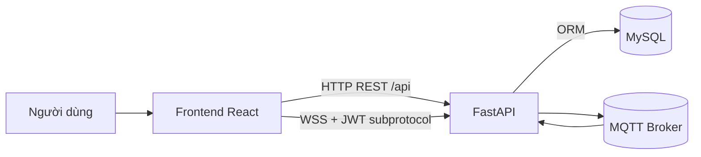

# Tài Liệu Kiến Trúc Hệ Thống

- **Mã tài liệu**: ARCH-IOT-001
- **Phiên bản**: 1.4.0
- **Ngày cập nhật**: 2026-08-02

## 1. Mục tiêu kiến trúc

- Tách bạch frontend và backend theo mô hình client-server.
- Đảm bảo bảo mật truy cập API bằng JWT và RBAC.
- Cho phép tích hợp dữ liệu thiết bị theo thời gian thực qua MQTT.
- Tạo nền tảng dễ bảo trì và mở rộng.

## 2. Kiến trúc mức cao

## 3. Thành phần chính

### 3.1 Frontend
- Vị trí mã nguồn: `app_service/src/`
- Vai trò:
  - Điều hướng người dùng.
  - Quản lý trạng thái đăng nhập (AuthContext).
  - Hiển thị dữ liệu dashboard, thiết bị, user management.
  - Gọi API backend qua `apiFetch`.
  - Nhận realtime qua WebSocket đã xác thực, không đưa JWT vào URL.

### 3.2 Backend
- Vị trí mã nguồn: `app_service/backend/app/`
- Vai trò:
  - Cung cấp REST API cho xác thực, user, device, authorization và group/invitation của map.
  - Quản lý nghiệp vụ phân quyền và trạng thái user.
  - Cung cấp policy quyền nhóm map, upload/xác thực WebP/PNG/JPEG, phân phối BLOB và archive transaction cho GPS Tracking.
  - Điều phối lifecycle khi xóa group/owner và seed floorplan hệ thống idempotent.
  - Kết nối DB.
  - Khởi tạo và giám sát MQTT subscriber.

### 3.3 Cơ sở dữ liệu
- Hệ quản trị: MySQL.
- Bảng chính:
  - `user`
  - `device`
  - `device_authorization`
  - `map_group`
  - `map_group_membership`
  - `locations_using`
  - `locations_deleted`

#### Lưu trữ ảnh bản đồ

- `locations_using` chứa map active và BLOB WebP/PNG/JPEG được GPS sử dụng.
- `locations_deleted` chứa archive đầy đủ, không có foreign key để giữ lịch sử khi user/group bị xóa.
- Lifecycle map được xác định bằng bảng chứa bản ghi, không dùng cột `status`.
- `map_group` và `map_group_membership` tạo nền cho mô hình owner/member nhiều-nhiều.

### 3.4 Tích hợp MQTT
- Subscriber khởi tạo trong lifecycle backend.
- Lưu tạm message gần nhất bằng buffer trong bộ nhớ.
- Cung cấp API quan sát trạng thái và message.

## 4. Luồng hệ thống trọng yếu

### 4.1 Luồng đăng nhập
1. Frontend gửi `POST /api/auth/login`.
2. Backend xác thực user + mật khẩu hash.
3. Backend trả JWT và user profile.
4. Frontend lưu JWT và dùng cho các request sau.

### 4.2 Luồng phân quyền truy cập thiết bị
1. User gọi danh sách thiết bị của mình.
2. Backend join `device_authorization` + kiểm tra hạn.
3. Trả về thiết bị còn hiệu lực.

### 4.3 Luồng nhóm bản đồ và lời mời

1. Owner hoặc admin tạo group; admin có thể chọn owner bằng username chính xác.
2. Owner/admin gửi invitation; backend lưu membership ở trạng thái `pending`.
3. User được mời accept hoặc reject lời mời của chính mình.
4. Chỉ membership `accepted` mới làm group xuất hiện trong phạm vi xem của user.
5. Mọi mutation quản trị kiểm tra `can_manage_group`; group ngoài quyền trả `404` để hạn chế IDOR.
6. GPS Dashboard gọi group/invitation API qua `mapGroupsApi` và hiển thị dialog quản lý tương ứng với vai trò.

### 4.4 Luồng upload và hiển thị map

1. Frontend lọc group có `can_manage`, kiểm tra nhanh file và gửi multipart.
2. Backend kiểm tra quyền, giới hạn request, giải mã WebP/PNG/JPEG, đối chiếu
   định dạng thực tế và lưu BLOB/metadata vào `locations_using`.
3. GPS lấy metadata theo group, sau đó chỉ gọi endpoint ảnh cho map đang chọn.
4. Endpoint ảnh kiểm tra lại quyền group rồi trả đúng MIME đã xác thực với
   `nosniff` và cache private/no-store.
5. Marker realtime được lọc bằng location đã trim và không phân biệt hoa/thường.
6. Device catalog cung cấp `devicename`; dữ liệu WebSocket chỉ cập nhật vị trí/thời gian
   và giữ lại metadata catalog khi merge.
7. GPS trình bày thiết bị thành `Tên(ID)` trong danh sách, chỉ hiện tên trên marker và
   fallback thành ID khi tên rỗng; X/Y chỉ dùng nội bộ để tính vị trí.
8. Đồng hồ giờ địa phương là component độc lập để tick một giây không re-render cây map.

### 4.5 Luồng khởi động backend
1. Chờ DB sẵn sàng.
2. Tạo/đồng bộ schema cơ bản.
3. Chạy patch migration nhẹ.
4. Seed admin mặc định, sau đó seed `Floor_1`…`Floor_4` vào `System Debug Maps`
   qua cùng validator WebP; bỏ qua location đã có ở active hoặc archive.
5. Khởi chạy MQTT subscriber.

### 4.6 Luồng archive map

1. Backend khóa bản ghi active bằng `SELECT ... FOR UPDATE`.
2. Nạp group, owner và người upload để tạo snapshot.
3. Chèn toàn bộ ảnh/metadata vào `locations_deleted`.
4. Xóa bản ghi tương ứng khỏi `locations_using`.
5. Caller commit toàn bộ nghiệp vụ hoặc rollback khi có lỗi.

### 4.7 Luồng xóa group hoặc owner

1. Backend khóa group và danh sách map active theo thứ tự ổn định.
2. Mọi map active được archive trước với lý do `group_deleted` hoặc `owner_deleted`.
3. Membership/invitation được dọn; khi xóa user, membership trong group owner khác
   chỉ bị dọn và không ảnh hưởng group/map đó.
4. Backend hard-delete group/user rồi commit cùng transaction.
5. Nếu archive hoặc ràng buộc dữ liệu lỗi, toàn bộ thay đổi được rollback và API trả `409`.

### 4.8 Luồng xác thực WebSocket

1. Trình duyệt mở `/ws/global` hoặc `/ws/devices/{device_id}` với subprotocol
   `iot-jwt` và JWT ở protocol thứ hai.
2. Backend xác thực JWT, kiểm tra user active và chỉ negotiate tên protocol công khai
   `iot-jwt`.
3. Thiết bị mở `/ws/esp32/{device_id}` bằng protocol `iot-device` hoặc header
   `x-device-password`.
4. Credential trong query string bị từ chối để URL/access log không chứa secret.

## 5. Quan điểm triển khai

- Frontend và backend triển khai độc lập.
- CORS cho phép frontend gọi backend theo cấu hình.
- Secret được cấu hình qua biến môi trường.
- Nginx reverse proxy cung cấp security header cho document và static asset.
- Bắt buộc TLS ở production để REST dùng HTTPS và realtime dùng WSS.

## 6. Rủi ro kỹ thuật và hướng xử lý

- **Rủi ro**: Một số màn hình còn phụ thuộc mock data fallback.
  - **Hướng xử lý**: Chuẩn hóa toàn bộ luồng sang API thật.

## 7. Đọc thêm: hướng dẫn chi tiết trong mã nguồn

- **[codebase-walkthrough.md](./codebase-walkthrough.md)** — thuật ngữ (JWT, RBAC, MQTT, …), bản đồ thư mục `app_service/`, thứ tự đọc file khi onboarding hoặc sau thời gian không chạm code.
- **[map-webp-phase1.md](./map-webp-phase1.md)** — schema, access policy, validator, archive transaction và phạm vi Phase 1.
- **[map-webp-phase4.md](./map-webp-phase4.md)** — cascade group/account, owner visibility và seed map hệ thống.
- **[map-webp-phase5.md](./map-webp-phase5.md)** — regression, WebSocket credential hardening và xác nhận production.
- Trong repo, các module Python chính có **module docstring**; hàm/route quan trọng có **docstring** giải thích vai trò. Frontend: **JSDoc** tại `main.jsx`, `App.jsx`, `IoTApp.jsx`, `AuthContext.jsx`, `lib/api.js`, các route guard và `Layout.jsx`.
